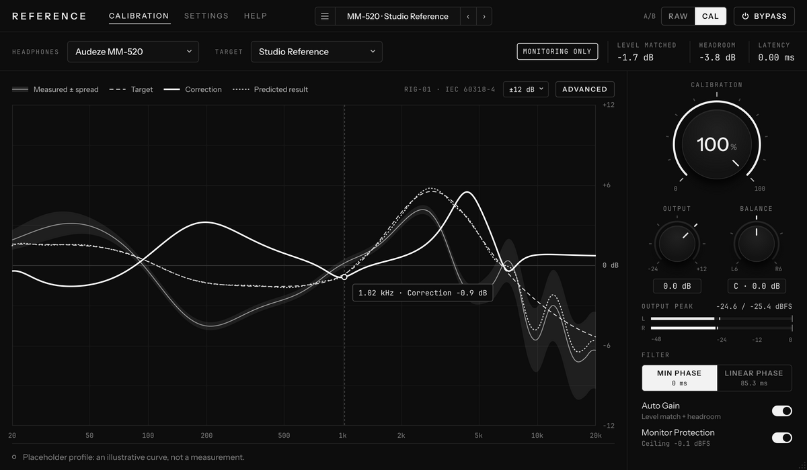
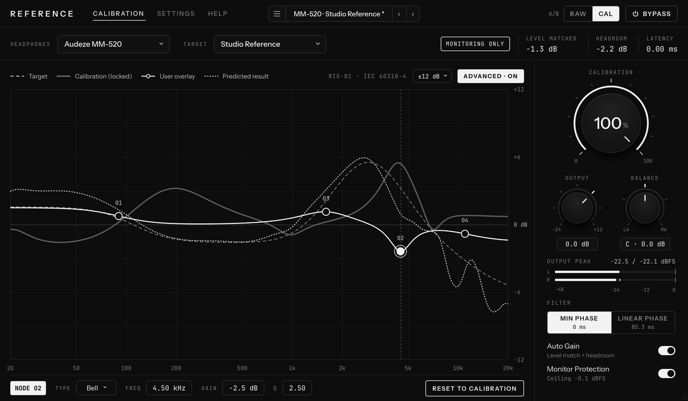

# REFERENCE — headphone calibration (VST3 · AU · system-wide app)

REFERENCE is a reference calibration for headphones, built from
*REFERENCE — Headphone Calibration Plugin Spec (Rev 2)* and the UI design
handoff. It moves a headphone model toward a chosen target measured on a named
rig, shows the measured, target, correction and predicted curves, and lets you
compare calibrated and raw at matched loudness.

It ships three ways from one codebase:

| Build | Use it for |
| --- | --- |
| **REFERENCE app** (standalone) | Calibrating everything your computer plays: music, browser, games, video calls |
| **VST3** (Windows, macOS, Linux) | Monitoring inside a DAW |
| **AU** (macOS) | Logic and other AU hosts |



> **The bundled headphone data are placeholders.** The MM-500 and MM-520
> profiles and the two rig-01 targets reproduce the illustrative curves from the
> design handoff. They are not measurements, so the correction they produce is not
> a calibration of real headphones. The app says so in its status line and in
> Settings. The spec (Section 4) requires owned or licensed measurements; see
> [Using real measurements](#using-real-measurements) to build your own profile.
> Not affiliated with or endorsed by Audeze.

## Get it

Every push to this folder builds Windows, macOS (universal) and Linux packages in
GitHub Actions (workflow **REFERENCE plugin**). Open the latest run and download
`REFERENCE-Windows`, `REFERENCE-macOS` or `REFERENCE-Linux`. Each contains the app,
the plugins, the profile tool and the font licences. The builds are unsigned:
Windows SmartScreen and macOS Gatekeeper will ask before the first launch
(macOS: right-click the app, then Open).

Plugin locations:

| | VST3 | AU |
| --- | --- | --- |
| Windows | `C:\Program Files\Common Files\VST3\` | |
| macOS | `~/Library/Audio/Plug-Ins/VST3/` | `~/Library/Audio/Plug-Ins/Components/` |
| Linux | `~/.vst3/` | |

## Calibrating all system audio

The app listens to a virtual loopback device that your computer plays into,
applies the calibration and plays the result on your headphones. The two
devices run on different clocks; the app measures the drift and resamples by a
fraction of a cent of pitch to absorb it, so there are no periodic dropouts, even
with sound servers that deliver audio in irregular bursts.

**Windows**

1. Install [VB-CABLE](https://vb-audio.com/Cable/) (free) and restart.
2. Sound settings → Output: choose **CABLE Input**.
3. In REFERENCE → Settings → System audio: Driver **Windows Audio**, Source **CABLE Output**,
   Headphones your headphone output.

**macOS**

1. Install [BlackHole 2ch](https://existential.audio/blackhole/) (`brew install blackhole-2ch`).
2. System Settings → Sound → Output: **BlackHole 2ch**.
3. In REFERENCE: Source **BlackHole 2ch**, Headphones your interface or headphones.
   Allow microphone access when asked; macOS uses that name for any audio input.

**Linux (PulseAudio or PipeWire)**

1. `pactl load-module module-null-sink sink_name=reference sink_properties=device.description=REFERENCE`
2. Make **REFERENCE** the default output (`pactl set-default-sink reference`).
3. In REFERENCE → Settings → System audio: Driver **ALSA**, and the PulseAudio or
   PipeWire sound server device as both Source and Headphones.
4. In Volume Control (`pavucontrol`): on *Recording*, set REFERENCE to
   **Monitor of REFERENCE**; on *Playback*, set REFERENCE to your headphones. The
   sound server remembers both.

**If the sound does not change:** quit REFERENCE and play some music. If you still
hear it, that app is not sending its sound to the loopback device, so REFERENCE
never receives it. On Windows, open Settings → System → Sound → Volume mixer, set
the app's output device to *Default* (or **CABLE Input**) and restart the app, and
make sure *Listen to this device* is off for CABLE Output (Sound Control Panel →
Recording → CABLE Output → Properties → Listen). On macOS, pick the system default
or BlackHole in the app's own audio settings. Settings → System audio shows the level
REFERENCE receives, and **Test sound** plays a tone through REFERENCE to your
headphones.

The app recognises VB-CABLE, BlackHole and Loopback by name and picks them as the
source on first run. It refuses to play into a loopback device it recognises, and
if its output still comes back into its input (on Linux, until step 4 is done) it
mutes itself and says so in the status line rather than let the level build up.
Closing the window keeps it running in the tray (Windows) or menu bar (macOS);
quit from there. Expect roughly 30–70 ms of added latency, depending on the
devices: 47 ms measured through PulseAudio, and Settings shows the app's estimate
for yours. That is fine for listening, not for monitoring while recording.
Settings remember your devices and the whole calibration state.

## Using it

* **Headphones / Target** pick the profile and target. Targets are tied to a rig;
  the generator refuses pairs from different rigs.
* **Calibration** scales the correction in dB (50% = half the correction at every
  frequency). **Output** is −24…+12 dB, **Balance** trims the louder side by up to
  6 dB. Drag (Shift for fine), scroll, double-click to reset, or type a value.
* **A/B** (or the **A** key) compares calibrated and raw at equal loudness.
  **Bypass** is a true, bit-exact off switch.
* **Filter**: Minimum Phase (zero latency) or Linear Phase (85 ms). Both come from
  the same correction curve.
* **Auto Gain** applies the static level match and headroom shown in the header.
  **Monitor Protection** is a last-resort soft clipper at −0.1 dBFS.
* **ADVANCED** (V2): double-click the graph to add filter nodes on top of the
  calibration, drag them, scroll for Q, Delete to remove. RESET TO CALIBRATION
  clears them.
  
* Presets: six factory presets plus your own (save, rename, delete, import, export).
* Offline exports are detected and bypassed automatically in plugin hosts.

## Using real measurements

Profiles are JSON files with provenance and a SHA-256 checksum; targets are CSV
files tagged with a rig. Put yours in the profiles folder (Settings → Your profiles
→ Open, then Reload):

* Windows `%APPDATA%\REFERENCE\`, macOS `~/Library/Application Support/REFERENCE/`,
  Linux `~/.config/REFERENCE/` — with `Profiles/` and `Targets/` inside.

Build a profile from one CSV per unit and reseat (frequency, dB per line;
AutoEq-style files work):

```sh
reference-profile-tool profile --id my_mm520 --name "Audeze MM-520" --manufacturer Audeze \
  --revision MM-520 --rig my-rig --ear-simulator "IEC 60318-4" --source in-house --license owned \
  --units 3 --targets my_target@1 --out my_mm520.json unit*_seat*.csv

reference-profile-tool target --id my_target --version 1 --rig my-rig \
  --name "My Target" --description "Diffuse-field response of my rig" --out my_target@1.csv my_df.csv

reference-profile-tool verify my_mm520.json
```

The profile stores the mean and the per-frequency spread; the correction is
generated when it loads (validate, resample to 1/48 octave, normalise 500 Hz–2 kHz,
variable smoothing, spread weighting, treble averaging above 9 kHz, clamp to
+6/−12 dB, fit ≤ 2 shelves and 10 bells with Q ≤ 3). Only use measurements you own
or are licensed to use, and a target defined on the same rig.

## Building from source

Requirements: CMake 3.22+, a C++20 compiler (MSVC 2022, Xcode 15, GCC 12+ or
Clang 15+). JUCE 8.0.15 is downloaded automatically. On Linux install the JUCE
dependencies (see the workflow file for the `apt-get` line).

```sh
cmake -S . -B build -DCMAKE_BUILD_TYPE=Release
cmake --build build --config Release --parallel
ctest --test-dir build -C Release --output-on-failure   # Linux: run under xvfb-run
```

Options: `-DREF_JUCE_DIR=/path/to/JUCE` (use a local checkout),
`-DREF_BUILD_PLUGIN=OFF` (engine and tests only), `-DREF_RTSAN=ON` with Clang 20
(RealtimeSanitizer). `REFERENCE --snapshot <dir>` renders every UI state to PNG.

Layout follows the spec: `dsp/` (JUCE-free engine and generator), `measurement/`
(profiles, targets, checksums), `profiles/` (data), `persistence/` (session state,
presets), `plugin/` (JUCE wrapper and worker thread), `ui/`, `standalone/`
(system-wide app), `tools/`, `tests/`.

## Spec acceptance (Section 12)

Automated, in CI on every platform:

| Row | Result |
| --- | --- |
| Filter accuracy | Both modes, all 8 rates 44.1–384 kHz: within 0.1 dB of the design, 20 Hz–20 kHz |
| Bypass | Bit-exact; Linear Phase bit-exact after the reported delay |
| Amount 0% | Null against bypass below −120 dBFS |
| Level match | Pink noise A vs B within 0.3 dB (BS.1770), both modes, 100% and 50% |
| Latency | Measured delay equals reported latency |
| Real-time safety | No allocations in `process()` across every transition; clean under Clang RealtimeSanitizer |
| Robustness | NaN, Inf, denormal, full-scale and 1e30 inputs: finite output, recovers next block |
| Smoothing | Amount and Output swept in 10 ms: no discontinuity above −80 dBFS |
| Render safety | Offline export bit-exact to the dry mix |
| State | Reload identical; removed or changed profile falls back to the embedded curve, identical output |
| Validation | pluginval strictness 10 (VST3), auval (macOS AU) |
| CPU | Min Phase 0.24%, Linear Phase 0.68% of one core (48 kHz, 64 samples) on the build machine |

Not automatable here, still to do before a release: correction validity and
generalisation on a real rig (needs real measurements), DAW host checks (Ableton,
FL Studio, Logic, REAPER, Cubase, Studio One, Bitwig), the Steinberg VST3
validator, the blind listening test, code signing and notarisation, and the data
rights checklist in Section 11.

## Decisions where the spec or design left room

* **A/B levels.** The raw side gets the same headroom but not the match gain; the
  calibrated side gets both. That is what makes the comparison equal in loudness,
  which is the stated purpose.
* **Match gain** is K-weighted over the whole 20 Hz–20 kHz grid rather than
  100 Hz–10 kHz, so it matches what the BS.1770 pink-noise acceptance test hears.
* **Minimum Phase accuracy.** Each biquad uses a matched-magnitude design with a
  least-squares numerator, and the cascade is refined per sample rate so it stays
  within 0.1 dB of the analogue design up to 20 kHz at 44.1 kHz.
* **Linear Phase.** 8,192 taps at 48 kHz scaled with rate; Tukey window; latency
  includes the convolver's partition, so the reported 85.3 ms is exact. New filter
  sets take over the running convolver's history, so Amount changes crossfade
  without gaps. Ultrasonic taper above 20 kHz applies to Linear Phase; Minimum
  Phase shelves hold their gain above 20 kHz.
* **Balance** follows the usual convention (turning right moves the image right by
  trimming the left channel) and the readout names the attenuated side.
* **Protection hold** is 2 s (proposed in the handoff). The A/B key is **A**.
* **Undrawn states**: the Help page, Linear Phase selected, the 800 × 500 minimum
  (graph legend and knobs compact; toggles move to Settings if the window is very
  short), toggles off and the latency-changed message all follow the handoff's
  tokens and type.
* **Standalone Settings** replace *Render safety* (no host, no offline render) with
  *System audio*.

## Licences

Built with JUCE 8 (AGPLv3 or a commercial JUCE licence; a closed-source release
needs a JUCE licence), the Steinberg VST3 SDK (MIT), Instrument Sans and JetBrains
Mono (SIL Open Font License 1.1, see `resources/fonts/`). VST is a registered
trademark of Steinberg Media Technologies GmbH. Model names are used only to state
compatibility; REFERENCE is not affiliated with or endorsed by Audeze.
